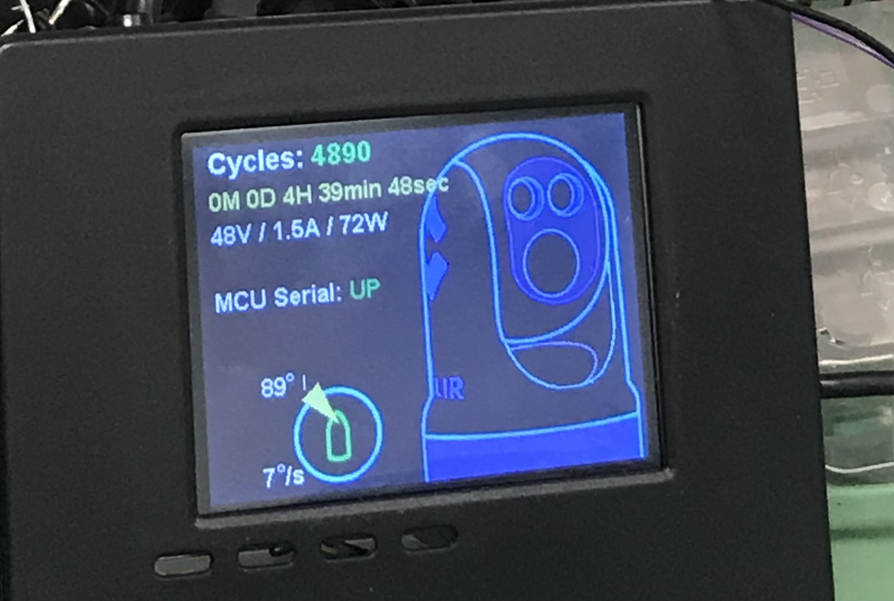

# Slip_Ring_Tester

Accelerated lifetime testing of new slip ring. Motor base rotated back and forth over 1,000,000 times. Simultaneously Ethernet traffic, UART traffic, and video was passed through slip ring

